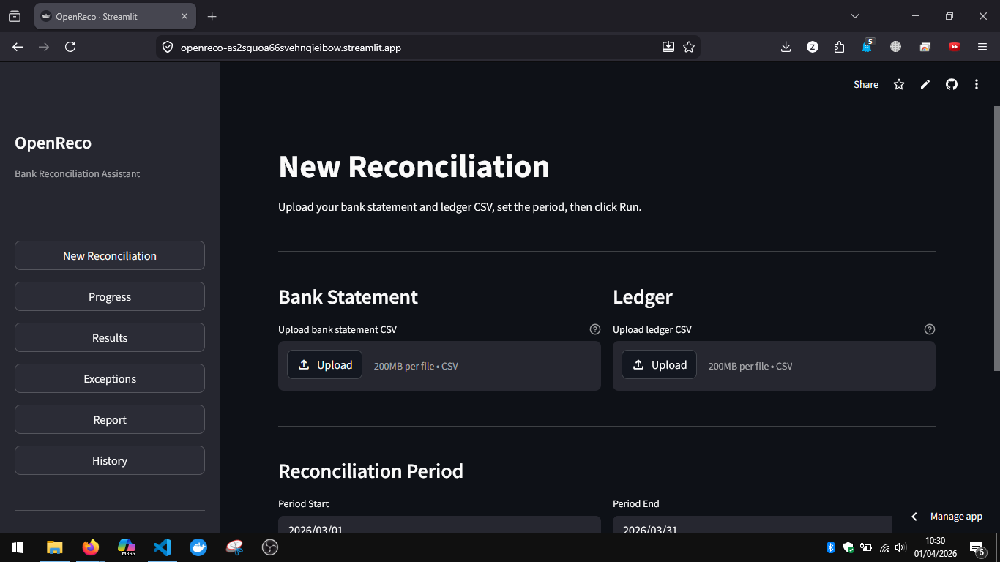

# OpenReco

> **Ongoing project.** OpenReco is being built as a standalone reconciliation module that will be integrated into a larger internal finance product. The architecture is intentionally designed to be pluggable: the LangGraph pipeline, agent interfaces, and state schema are all built with that future integration in mind.

---

## The Problem

Manual bank reconciliation is one of those finance tasks that sounds simple until you actually do it at scale.

Every month, a finance team has to:
- Export a bank statement CSV
- Export a ledger CSV from their accounting system
- Manually match hundreds of rows across both files
- Hunt down anything that doesn't match
- Write up a report explaining what was found

The pain points are real:
- **Column names are never consistent.** One bank exports `Txn Date`, another exports `Value Date`, another exports `Date`. Same for amounts: `Debit/Credit`, `Amount`, `Dr/Cr`.
- **Dates slip.** A payment posted on March 31 might appear in the ledger on April 1. Exact matching fails.
- **Descriptions don't match.** The bank says `GRAB *PAYMENT MAR26`. The ledger says `Grab ride payment`. These are the same thing.
- **Exceptions pile up.** When something doesn't match, someone has to reason about why: is it a timing issue, a duplicate, a missing entry, or something that needs urgent attention?
- **The report takes hours.** Compiling the findings into something a manager can read takes longer than the matching itself.

---

## The Fix

OpenReco automates the full reconciliation loop:

1. **Auto-detect columns.** No manual mapping needed. If the headers are ambiguous, DeepSeek infers them from the first 5 rows.
2. **5-tier matching.** Goes from strict exact match down to fuzzy description matching, so timing differences and description variations don't cause false misses.
3. **AI-powered exception investigation.** DeepSeek reasons about each unmatched item, suggests what to check, and rates the risk level.
4. **One-click report.** A 7-sheet Excel report and a plain-language management summary, generated automatically.

---

## Why Multi-Agent / LangGraph

Yes, you could write this as a single 300-line Python script with pandas and rapidfuzz. And for a one-off reconciliation, you should.

OpenReco is built the way it is because:

- **It is a module, not a script.** It will be embedded into a larger product. The agent/node interface means each piece can be swapped, upgraded, or parallelised independently without touching the rest.
- **The LLM parts are real.** DeepSeek doing exception investigation and narrative writing is not decorative. It replaces hours of manual finance analyst work per run.
- **The state machine matters for UIs.** The Telegram bot and Streamlit app both need to know *which stage* the pipeline is at to show progress. A single script can't expose that naturally. LangGraph's node-by-node execution can.
- **Future parallelism.** Agent 4 is already structured to investigate exceptions concurrently. That matters when a reconciliation has 50+ exceptions.

Deliberately overengineered for a portfolio project? Yes. Deliberately designed for a real integration? Also yes.

---

## Pipeline

```
Bank CSV ──┐
           ├──► Agent 1: Document Ingestion
Ledger CSV ┘         │ normalise to Transaction schema
                     ▼
              Agent 2: Ledger Sync
                     │ normalise to LedgerEntry schema
                     ▼
              Agent 3: Reconciliation Engine
                     │ 5-strategy matching, flag exceptions
                     ▼
              Agent 4: Exception Investigator  ← DeepSeek (1 call per exception)
                     │ investigate, rate risk, suggest action
                     ▼
              Agent 5: Report Writer           ← DeepSeek (1 call for summary)
                     │ 7-sheet Excel + narrative
                     ▼
              data/reports/recon_*.xlsx
```

### Matching strategies (priority order)

| Priority | Strategy | Confidence | Rule |
|---|---|---|---|
| 1 | EXACT | 100% | Same amount + same date + reference match |
| 2 | AMOUNT_DATE | 95% | Same amount + date within 1 day |
| 3 | AMOUNT_REFERENCE | 90% | Same amount + reference substring match |
| 4 | AMOUNT_FUZZY | 75% | Same amount + description similarity above 80% |
| 5 | AMOUNT_ONLY | 60% | Same amount + date within 3 days |

---

## Streamlit UI



Six pages connected through `st.session_state`:

| Page | What it shows |
|---|---|
| New Reconciliation | File uploaders, period picker, run button |
| Progress | Live agent-by-agent status as the pipeline runs |
| Results | Match rate, KPI metrics, matched pairs table, charts |
| Exceptions | Filterable exception list with DeepSeek investigation notes |
| Report | Download button for Excel, narrative summary display |
| History | Past sessions from SQLite with drill-down |

---

## Install

```bash
git clone https://github.com/Zahrinnnnn/OpenReco.git
cd OpenReco

python -m venv .venv
# Windows
.venv\Scripts\activate
# macOS / Linux
source .venv/bin/activate

pip install -r requirements.txt
```

---

## Configure

```bash
cp .env.example .env
```

Edit `.env`:

```env
DEEPSEEK_API_KEY=your_key_here       # get free at platform.deepseek.com
TELEGRAM_BOT_TOKEN=your_token_here   # only needed for Telegram bot
```

Everything else has working defaults.

---

## Run

### Streamlit (recommended)

```bash
streamlit run app.py
```

Open http://localhost:8501, upload your CSVs, pick a period, click Run.

### CLI

```bash
python main.py \
  --bank data/uploads/bank.csv \
  --ledger data/uploads/ledger.csv \
  --start 2026-03-01 \
  --end 2026-03-31
```

### Telegram bot

```bash
python bot.py
```

Send `/reconcile` to your bot. It will guide you through uploading both files and picking a period, then deliver the Excel report directly in chat.

---

## Test results

Run against `tests/fixtures/sample_bank.csv` (50 rows) and `tests/fixtures/sample_ledger.csv` (50 rows):

```
Period:      2026-03-01 to 2026-03-31
Matched:     47 / 49  (95.9% match rate)
Exceptions:  10 items flagged  (4 high risk)
Unmatched:   RM 8,750.00
Report:      data/reports/recon_20260401.xlsx
```

Excel report, all 7 sheets populated:

| Sheet | Rows |
|---|---|
| Summary | KPIs, period, narrative |
| Matched | 47 matched pairs |
| Exceptions | 10 exceptions |
| Bank Only | 2 unmatched bank transactions |
| Ledger Only | 3 unmatched ledger entries |
| All Transactions | 49 rows |
| All Ledger | 50 rows |

Unit test suite:

```bash
pytest tests/ -v
# 66 passed in 3.56s
```

Covers: column auto-detection, date normalisation, all 5 matching strategies, fuzzy scoring, exception generation, deduplication, DeepSeek mocking, Excel sheet validation, report writer fallback.

---

## CSV format

No fixed headers required. OpenReco auto-detects date, amount, description, and reference columns. If detection is ambiguous, DeepSeek infers the mapping from the first 5 rows.

Sample files in `tests/fixtures/` show typical Malaysian bank statement and ledger formats.

---

## Environment variables

| Variable | Default | Description |
|---|---|---|
| `DEEPSEEK_API_KEY` | required | Exception investigation + narrative summary |
| `DEEPSEEK_BASE_URL` | `https://api.deepseek.com` | API endpoint |
| `DEEPSEEK_MODEL` | `deepseek-chat` | Model name |
| `TELEGRAM_BOT_TOKEN` | optional | Telegram bot only |
| `DB_PATH` | `data/database.db` | SQLite file |
| `UPLOAD_DIR` | `data/uploads` | Uploaded CSV storage |
| `REPORT_DIR` | `data/reports` | Excel report output |
| `HIGH_VALUE_THRESHOLD` | `5000` | RM amount for HIGH_VALUE exception |
| `FUZZY_THRESHOLD` | `0.80` | Minimum similarity for AMOUNT_FUZZY strategy |
| `DATE_TOLERANCE_DAYS` | `3` | Max days apart for AMOUNT_ONLY strategy |
| `AMOUNT_TOLERANCE` | `0.01` | Max RM difference to count as same amount |

---

## Project structure

```
OpenReco/
├── main.py                    # CLI entry point
├── bot.py                     # Telegram bot
├── app.py                     # Streamlit entry point
├── requirements.txt
├── .env.example
├── src/
│   ├── agents/                # 5 pipeline agents
│   │   ├── document_ingestion.py
│   │   ├── ledger_sync.py
│   │   ├── reconciliation_engine.py
│   │   ├── exception_investigator.py
│   │   └── report_writer.py
│   ├── graph/                 # LangGraph pipeline wiring
│   │   ├── state.py
│   │   ├── pipeline.py
│   │   └── router.py
│   ├── matching/              # Matching strategies and exception logic
│   │   ├── exact_match.py
│   │   ├── fuzzy_match.py
│   │   └── exceptions.py
│   ├── reports/               # Excel report builder
│   │   └── excel_report.py
│   ├── database/              # SQLite queries
│   │   ├── connection.py
│   │   └── queries.py
│   ├── images/
│   │   └── 1.PNG
│   └── utils/
│       ├── normaliser.py
│       ├── validators.py
│       └── logger.py
├── tests/
│   ├── test_agents.py
│   ├── test_matching.py
│   └── fixtures/
│       ├── sample_bank.csv
│       └── sample_ledger.csv
└── ui/
    └── pages/
        ├── home.py
        ├── progress.py
        ├── results.py
        ├── exceptions.py
        ├── report.py
        └── history.py
```

---

## Cost

Each full run costs under USD 0.05 on DeepSeek pricing: roughly USD 0.001 per exception investigation and USD 0.002 for the narrative summary.
